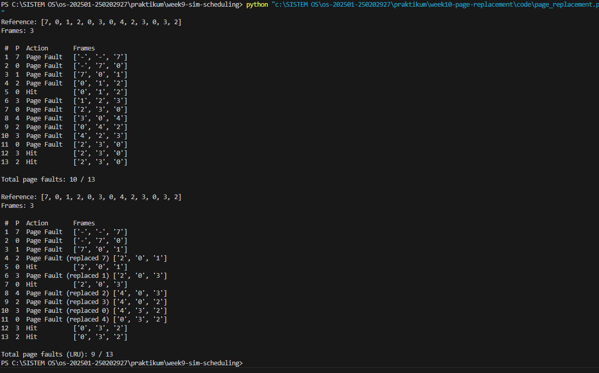

# Laporan Praktikum Minggu [10]
Topik: [Manajemen Memori – Page Replacement (FIFO & LRU)]

---

## Identitas
- **Nama**  : [Ahmad Wildan Asrovi]  
- **NIM**   : [250202927]  
- **Kelas** : [1IKRB]

---

## Tujuan
Tuliskan tujuan praktikum minggu ini.  

1. Mengimplementasikan algoritma page replacement FIFO dalam program.
2. Mengimplementasikan algoritma page replacement LRU dalam program.
3. Menjalankan simulasi page replacement dengan dataset tertentu.
4. Membandingkan performa FIFO dan LRU berdasarkan jumlah page fault.
5. Menyajikan hasil simulasi dalam laporan yang sistematis.

---

## Dasar Teori
1.Manajemen Memori Virtual memungkinkan program berjalan meskipun ukuran fisiknya lebih kecil dari kebutuhan program, dengan membagi memori menjadi halaman (paging).

2.Page Replacement diperlukan ketika page fault terjadi dan memori penuh—algoritma menentukan halaman mana yang harus diganti untuk memuat halaman baru.

3.FIFO (First-In First-Out) mengganti halaman yang paling awal masuk ke memori tanpa mempertimbangkan frekuensi penggunaan atau kebutuhan ke depan.

4.LRU (Least Recently Used) mengganti halaman yang paling lama tidak digunakan, berdasarkan asumsi bahwa halaman yang baru digunakan kemungkinan besar akan digunakan kembali.

5.Jumlah page fault menjadi ukuran utama dalam menilai efisiensi algoritma: semakin sedikit page fault, semakin baik kinerja penggantian halaman.

---

## Langkah Praktikum
1.Menyiapkan Data
Menentukan reference string halaman: 7, 0, 1, 2, 0, 3, 0, 4, 2, 3, 0, 3, 2
Menentukan jumlah frame memori: 3 frame.

2.Membuat Program Simulasi
Membuat fungsi simulate_fifo() untuk mensimulasikan algoritma FIFO.
Membuat fungsi simulate_lru() untuk mensimulasikan algoritma LRU.
Menambahkan proses perhitungan page hit dan page fault.

3.Menjalankan Program
Menjalankan simulasi FIFO menggunakan reference string dan frame yang telah ditentukan.
Menjalankan simulasi LRU dengan parameter yang sama.

4.Mencatat dan Menganalisis Hasil
Mengamati kondisi frame pada setiap langkah referensi halaman.
Mencatat jumlah page fault pada FIFO dan LRU.
Membandingkan hasil kedua algoritma untuk melihat efisiensi.

---

## Kode / Perintah
Tuliskan potongan kode atau perintah utama:
```bash
ef simulate_fifo(reference, frames):

    frame_list = []
    faults = 0

    print(f"Reference: {reference}")
    print(f"Frames: {frames}\n")
    print(f"{'#':>2} {'P':>2}  Action       Frames")

    for i, p in enumerate(reference, start=1):
        if p in frame_list:
            action = 'Hit'
        else:
            faults += 1
            action = 'Page Fault'
            if len(frame_list) < frames:
                frame_list.append(p)
            else:
                frame_list.pop(0)
                frame_list.append(p)

        display = ['-'] * (frames - len(frame_list)) + [str(x) for x in frame_list]
        print(f"{i:>2} {p:>2}  {action:12} {display}")

    print(f"\nTotal page faults: {faults} / {len(reference)}")


if __name__ == '__main__':
    # example reference string and 3 frames
    ref = [7, 0, 1, 2, 0, 3, 0, 4, 2, 3, 0, 3, 2]
    simulate_fifo(ref, 3)

    # SIMULASI 2: LRU (Least Recently Used)
    
    def simulate_lru(reference, frames):

        frame_list = []
        recent = []  # most recent at end
        faults = 0

        print()
        print(f"Reference: {reference}")
        print(f"Frames: {frames}\n")
        print(f"{'#':>2} {'P':>2}  Action       Frames")
```

---

## Hasil Eksekusi
Sertakan screenshot hasil percobaan atau diagram:


---

## Analisis
Hasil percobaan menunjukkan bagaimana strategi penggantian halaman memengaruhi jumlah page fault. Pada reference string yang sama, algoritma LRU biasanya menghasilkan lebih sedikit page fault dibandingkan FIFO, karena LRU memilih halaman yang paling jarang dipakai terakhir, sehingga lebih sesuai dengan pola akses data yang berulang.

Pada algoritma FIFO, halaman yang masuk pertama akan dikeluarkan terlebih dahulu tanpa mempertimbangkan apakah halaman tersebut masih sering dipakai. Hal ini membuat FIFO lebih sederhana, tetapi dapat menyebabkan anomali Belady, yaitu jumlah frame lebih banyak belum tentu menurunkan page fault.

Dengan observasi frame saat simulasi berjalan, terlihat bahwa LRU lebih adaptif terhadap pola referensi, sehingga halaman yang masih sering diakses dipertahankan lebih lama di memori. Efeknya, jumlah page fault pada LRU cenderung lebih stabil atau lebih rendah, terutama pada dataset yang memiliki pengulangan nilai.

Secara keseluruhan, percobaan membuktikan bahwa pemilihan algoritma memori berdampak langsung pada performa sistem, terutama pada efisiensi penggunaan memori dan kecepatan eksekusi program yang bergantung pada jumlah page fault.

---

## Kesimpulan
Algoritma penggantian halaman memiliki dampak langsung pada performa sistem: semakin kecil jumlah page fault, semakin efisien penggunaan memori dan semakin cepat proses berjalan.

LRU umumnya memberikan hasil lebih baik daripada FIFO pada pola akses yang berulang, karena mempertahankan halaman yang baru digunakan dan membuang halaman yang jarang dipakai.

FIFO lebih mudah diimplementasikan, tetapi kurang adaptif terhadap pola referensi, sehingga berpotensi menghasilkan lebih banyak page fault dan bahkan anomali Belady pada kondisi tertentu.

---

## Quiz
1. [Apa perbedaan utama FIFO dan LRU?]  

   **FIFO mengganti halaman yang masuk paling awal, sedangkan LRU mengganti halaman yang paling lama tidak digunakan.**
    
3. [Mengapa FIFO dapat menghasilkan Belady’s Anomaly?]  

   **Karena FIFO tidak mempertimbangkan pola penggunaan halaman, sehingga menambah jumlah frame justru bisa membuat page fault meningkat.**
    
5. [Mengapa LRU umumnya menghasilkan performa lebih baik dibanding FIFO?]  

    **Karena LRU mempertahankan halaman yang baru digunakan, sehingga lebih sesuai dengan pola akses nyata yang sering mengulang data, sehingga page fault cenderung lebih sedikit.**  

---

## Refleksi Diri
Tuliskan secara singkat:
- Apa bagian yang paling menantang minggu ini?  
- Bagaimana cara Anda mengatasinya?  

---

**Credit:**  
_Template laporan praktikum Sistem Operasi (SO-202501) – Universitas Putra Bangsa_
