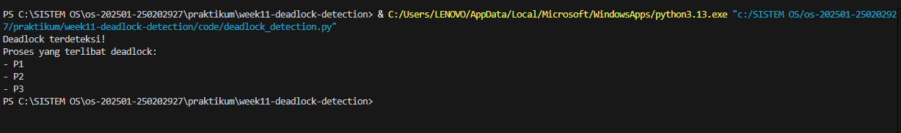

# Laporan Praktikum Minggu [11]
Topik: [Simulasi dan Deteksi Deadlock]

---

## Identitas
- **Nama**  : [Ahmad wildan asrovi]  
- **NIM**   : [250202927]  
- **Kelas** : [1IKRB]

---

## Tujuan
Setelah menyelesaikan tugas ini, mahasiswa mampu:

1. Membuat program sederhana untuk mendeteksi deadlock.
2. Menjalankan simulasi deteksi deadlock dengan dataset uji.
3. Menyajikan hasil analisis deadlock dalam bentuk tabel.
4. Memberikan interpretasi hasil uji secara logis dan sistematis.
5. Menyusun laporan praktikum sesuai format yang ditentukan.
---

## Dasar Teori
1.Deadlock adalah kondisi pada sistem operasi ketika dua atau lebih proses saling menunggu sumber daya yang sedang dipegang oleh proses lain sehingga tidak ada proses yang dapat melanjutkan eksekusi. Deadlock umumnya terjadi karena resource bersifat eksklusif dan tidak dapat diambil secara paksa.

2.Untuk mendeteksi deadlock, sistem operasi dapat menggunakan wait-for graph, yaitu graf berarah yang merepresentasikan hubungan ketergantungan antar proses. Jika dalam graf tersebut terdapat siklus, maka dapat disimpulkan bahwa sistem berada dalam kondisi deadlock.

3.Algoritma deteksi deadlock bekerja dengan menganalisis alokasi dan permintaan resource oleh setiap proses. Pada praktikum ini, deteksi dilakukan dengan membangun wait-for graph dari data proses dan mencari siklus sebagai indikasi terjadinya deadlock.

---

## Langkah Praktikum
1.Menyiapkan lingkungan praktikum berupa Python dan Visual Studio Code.

2.Membuat dataset deadlock dalam format CSV yang berisi data proses, allocation, dan request.

3.Membaca dataset CSV ke dalam program Python.

4.Membangun wait-for graph berdasarkan allocation dan request proses.

5.Mendeteksi deadlock dengan mencari siklus pada wait-for graph dan menampilkan hasilnya.

---

## Kode / Perintah
Tuliskan potongan kode atau perintah utama:
```bash
import csv

# Membaca dataset dari CSV
processes = {}

with open(
    r"C:\SISTEM OS\os-202501-250202927\praktikum\week11-deadlock-detection\code\dataset_deadlock.csv",
    newline="") as csvfile:
    reader = csv.DictReader(csvfile)
    for row in reader:
        processes[row["Process"]] = {
            "alloc": row["Allocation"],
            "req": row["Request"]
        }

# Membuat wait-for graph
wait_for = {}

for p1 in processes:
    for p2 in processes:
        if processes[p1]["req"] == processes[p2]["alloc"]:
            wait_for[p1] = p2

# Deteksi deadlock (cycle detection)
visited = set()
deadlock_processes = []

for p in wait_for:
    current = p
    path = set()

    while current not in path:
        path.add(current)
        current = wait_for.get(current)
        if current is None:
            break

    if current in path:
        deadlock_processes = list(path)
        break

# Output hasil
if deadlock_processes:
    print("Deadlock terdeteksi!")
    print("Proses yang terlibat deadlock:")
    for p in deadlock_processes:
        print("-", p)
else:
    print("Tidak terjadi deadlock")

```

---

## Hasil Eksekusi
Sertakan screenshot hasil percobaan atau diagram:


---

## Analisis
Berdasarkan hasil eksekusi program, terdeteksi adanya deadlock pada sistem. Hal ini ditunjukkan dengan ditemukannya siklus pada wait-for graph yang dibangun dari data allocation dan request proses. Siklus tersebut menyebabkan setiap proses saling menunggu resource yang dipegang proses lain sehingga tidak ada proses yang dapat melanjutkan eksekusi.

Hasil deteksi program sesuai dengan analisis manual, di mana semua proses yang terlibat dalam siklus dinyatakan mengalami deadlock. Dengan demikian, algoritma deteksi deadlock yang diimplementasikan telah berjalan dengan benar.  

---

## Kesimpulan
Berdasarkan hasil praktikum, dapat disimpulkan bahwa deadlock terjadi ketika terdapat siklus ketergantungan antar proses dalam penggunaan resource. Implementasi algoritma deteksi deadlock menggunakan wait-for graph berhasil mendeteksi kondisi deadlock dan mengidentifikasi proses yang terlibat. Hasil yang diperoleh sesuai dengan analisis manual, sehingga dapat disimpulkan bahwa program deteksi deadlock berjalan dengan baik.

---

## Quiz
1. [Apa perbedaan antara deadlock prevention, avoidance, dan detection?]

    -**Deadlock prevention adalah pendekatan yang mencegah terjadinya deadlock dengan menghilangkan salah satu dari empat kondisi deadlock.**

    -**Deadlock avoidance adalah pendekatan yang menghindari deadlock dengan memastikan sistem selalu berada pada keadaan aman sebelum mengalokasikan resource.**

    -**Deadlock detection adalah pendekatan yang mengizinkan deadlock terjadi, kemudian mendeteksinya dan melakukan penanganan setelah deadlock teridentifikasi.**
   
3. [Mengapa deteksi deadlock tetap diperlukan dalam sistem operasi?]  
   **Deteksi deadlock diperlukan karena tidak semua sistem dapat menerapkan prevention atau avoidance secara efisien. Pada sistem dengan banyak proses dan resource, deteksi deadlock memberikan fleksibilitas dengan            membiarkan sistem berjalan normal dan menangani deadlock hanya ketika benar-benar terjadi.**
   
5. [Apa kelebihan dan kekurangan pendekatan deteksi deadlock?]  
   -**Kelebihan deteksi deadlock adalah lebih fleksibel dan tidak membatasi alokasi resource secara ketat.**
   
   -**Kekurangan deteksi deadlock adalah membutuhkan overhead komputasi tambahan dan deadlock tetap dapat terjadi sebelum ditangani.**  

---

## Refleksi Diri

Melalui praktikum ini, saya memahami konsep deadlock serta cara mendeteksinya menggunakan wait-for graph. Praktikum ini membantu saya mengaitkan teori deadlock dengan implementasi nyata dalam program Python. Selain itu, kegiatan ini meningkatkan pemahaman saya tentang pentingnya pengelolaan resource dalam sistem operasi.

---

**Credit:**  
_Template laporan praktikum Sistem Operasi (SO-202501) – Universitas Putra Bangsa_
