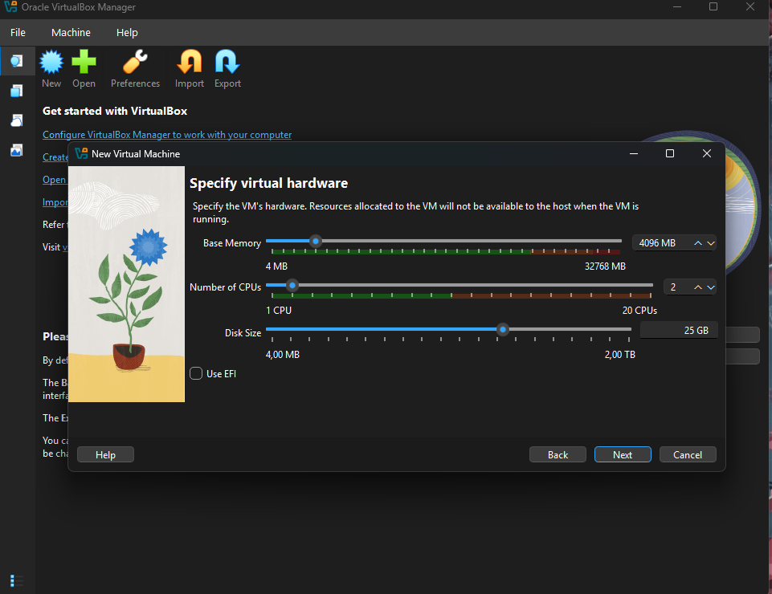
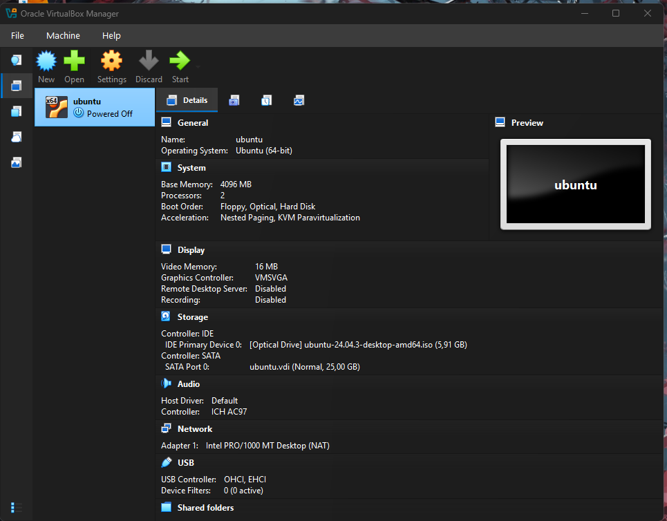

# Laporan Praktikum Minggu [12]
Topik: [Virtualisasi Menggunakan Virtual Machine]

---

## Identitas
- **Nama**  : [Ahmad Wildan Asrovi]  
- **NIM**   : [250202927]  
- **Kelas** : [1IKRB]

---

## Tujuan
Setelah menyelesaikan tugas ini, mahasiswa mampu:

1. Menginstal perangkat lunak virtualisasi (VirtualBox/VMware).
2. Membuat dan menjalankan sistem operasi guest di dalam VM.
3. Mengatur konfigurasi resource VM (CPU, RAM, storage).
4. Menjelaskan mekanisme proteksi OS melalui virtualisasi.
5. Menyusun laporan praktikum instalasi dan konfigurasi VM secara sistematis.

---

## Dasar Teori

1.Virtualisasi memungkinkan satu komputer fisik menjalankan beberapa sistem operasi secara bersamaan dengan memanfaatkan hypervisor sebagai pengelola sumber daya.

2.Hypervisor bertugas mengisolasi dan mengatur akses CPU, memori, storage, dan perangkat I/O antara host dan guest agar tidak saling mengganggu.

3.Virtual Machine (VM) menyediakan lingkungan terisolasi (sandbox) sehingga sistem operasi guest dapat diuji atau digunakan tanpa memengaruhi sistem host.

4.Isolasi sumber daya pada VM meningkatkan keamanan dan stabilitas sistem, karena kesalahan atau crash pada guest tidak berdampak langsung ke host.

5.Hardening OS dapat diterapkan pada guest dan host dengan membatasi akses, layanan, dan sumber daya untuk memperkecil risiko keamanan.

---

## Langkah Praktikum
**1.Menyiapkan lingkungan**

  -Mengaktifkan fitur virtualization pada sistem host.
  -Mengunduh dan menginstal VirtualBox di sistem operasi host.
  -Mengunduh file ISO Ubuntu Desktop (LTS).

**2.Konfigurasi awal VirtualBox**

  -Mengatur Default Machine Folder ke drive yang diinginkan (misalnya drive D).
  -Memastikan tidak ada invalid settings pada VirtualBox. 
  
**3.Membuat mesin virtual baru**

  -Membuat VM baru dengan tipe Linux dan versi Ubuntu (64-bit).
  -Menentukan alokasi RAM dan CPU sesuai kemampuan sistem.
  -Membuat virtual hard disk (VDI) dengan metode dynamically allocated.

4.Pengaturan sistem VM

  -Menonaktifkan opsi Use EFI.
  -Menonaktifkan Unattended Installation agar instalasi dilakukan manual.
  -Menambahkan file ISO Ubuntu pada menu Storage.

5.Instalasi Ubuntu

  -Menjalankan VM dan memilih Install Ubuntu.
  -Mengatur bahasa, keyboard.
  -Membuat akun pengguna dan menunggu proses instalasi selesai.

6.Penyelesaian instalasi

  -Me-restart VM setelah instalasi selesai.
  -Login ke desktop Ubuntu.

---

## Kode / Perintah

---

## Hasil Eksekusi
Sertakan screenshot hasil percobaan atau diagram:

---

## Analisis
Instalasi Ubuntu menggunakan VirtualBox berhasil dilakukan tanpa memengaruhi sistem host karena seluruh proses berjalan pada lingkungan virtual yang terisolasi. VirtualBox berfungsi sebagai hypervisor yang mengelola sumber daya dan menerapkan konsep sandboxing, sehingga guest OS tidak dapat mengakses hardware host secara langsung. Pengaturan instalasi manual meningkatkan kestabilan sistem, sementara Guest Additions membantu mengoptimalkan tampilan dan kinerja Ubuntu. Praktikum ini menunjukkan bahwa virtualisasi merupakan metode yang aman dan efektif untuk pembelajaran sistem operasi.

---

## Kesimpulan
1. Instalasi Ubuntu menggunakan VirtualBox berhasil dilakukan dengan aman tanpa memengaruhi sistem operasi host.

2. Teknologi virtualisasi menyediakan isolasi yang baik antara host dan guest melalui hypervisor.

3. Mesin virtual berfungsi sebagai sandbox yang mendukung keamanan dan stabilitas sistem.

4. Pengaturan sistem yang tepat serta instalasi Guest Additions meningkatkan performa dan kenyamanan penggunaan Ubuntu.

---

## Quiz
1. [Apa perbedaan antara host OS dan guest OS?]
   
   **Host OS adalah sistem operasi utama yang berjalan langsung di perangkat keras fisik dan mengelola sumber daya komputer.**
   
    **Guest OS adalah sistem operasi yang berjalan di dalam mesin virtual dan menggunakan sumber daya virtual yang disediakan oleh host melalui hypervisor.**
    
2. [Apa peran hypervisor dalam virtualisasi?]
     
   **Hypervisor berperan sebagai pengelola virtualisasi yang mengatur, membagi, dan mengisolasi sumber daya perangkat keras (CPU, memori, storage, dan I/O) agar dapat digunakan secara aman oleh satu atau lebih guest OS.**
    
3. [Mengapa virtualisasi meningkatkan keamanan sistem?]
   
   **Virtualisasi meningkatkan keamanan karena menyediakan isolasi (sandboxing) antara host dan guest, sehingga kesalahan, crash, atau serangan pada guest OS tidak langsung memengaruhi sistem host atau mesin virtual lainnya.**
   

---

## Refleksi Diri
Melalui praktikum ini, saya memahami konsep dasar virtualisasi serta perbedaan antara host OS dan guest OS. Saya juga belajar melakukan instalasi Ubuntu menggunakan VirtualBox secara mandiri dan memahami pentingnya pengaturan sistem agar tetap aman dan stabil. Praktikum ini menambah pemahaman saya tentang penerapan mesin virtual sebagai media pembelajaran sistem operasi yang efektif dan aman.

---

**Credit:**  
_Template laporan praktikum Sistem Operasi (SO-202501) – Universitas Putra Bangsa_
