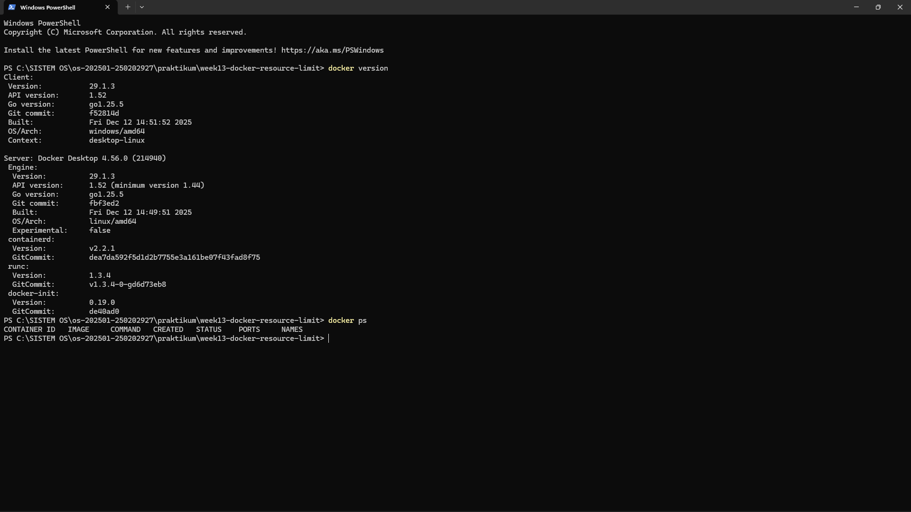
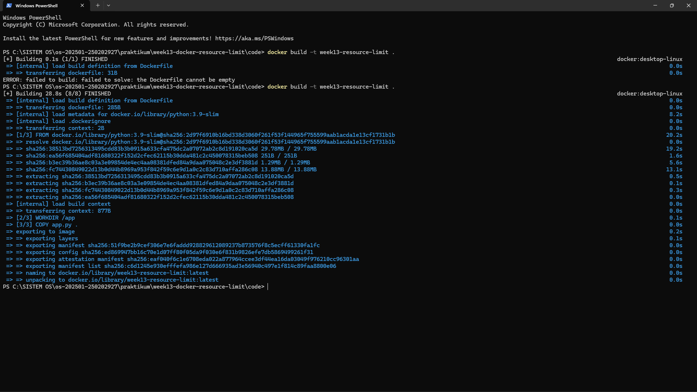
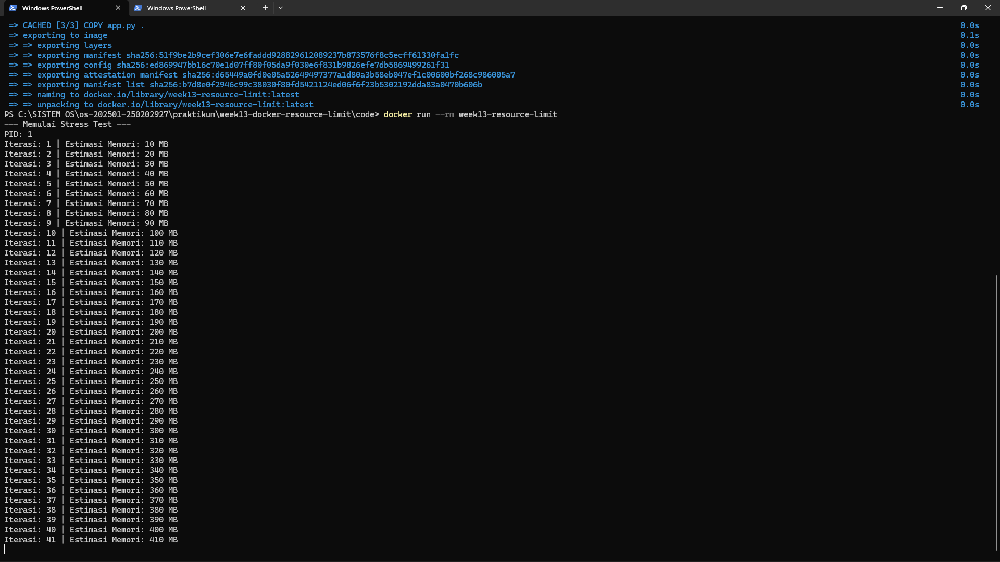
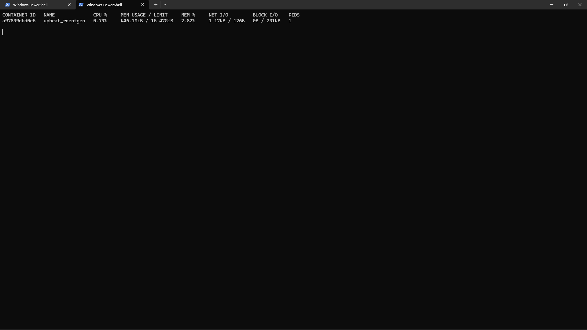
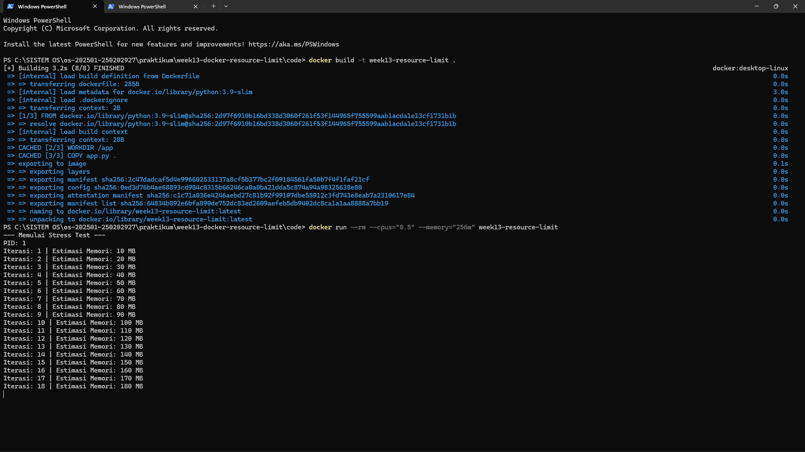
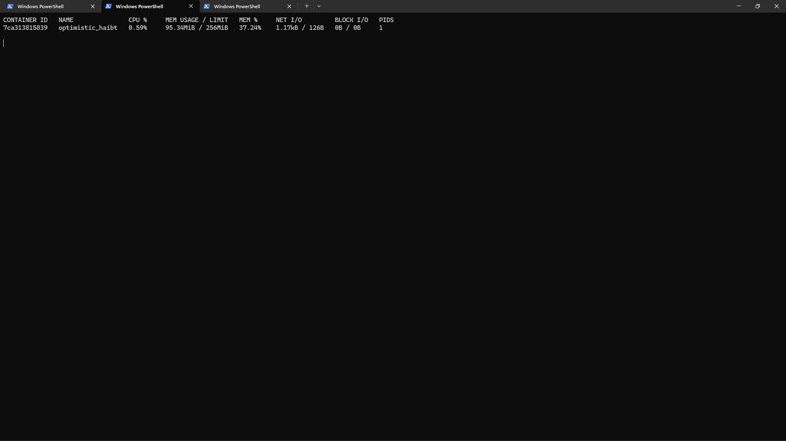

# Laporan Praktikum Minggu [13]
Topik: [Docker – Resource Limit (CPU & Memori)]

---

## Identitas
- **Nama**  : [Ahmad Wildan Asrovi]  
- **NIM**   : [290202927]  
- **Kelas** : [1IKRB]

---

## Tujuan
Setelah menyelesaikan tugas ini, mahasiswa mampu:

1. Menulis Dockerfile sederhana untuk sebuah aplikasi/skrip.
2. Membangun image dan menjalankan container.
3. Menjalankan container dengan pembatasan CPU dan memori.
4. Mengamati dan menjelaskan perbedaan eksekusi container dengan dan tanpa limit resource.
5. Menyusun laporan praktikum secara runtut dan sistematis.
---

## Dasar Teori
**1.Containerization**

Docker menggunakan container untuk menjalankan aplikasi dalam lingkungan terisolasi. Container berbagi kernel dengan sistem operasi host namun tetap terpisah dalam hal proses dan sistem file.

**2.Isolasi dengan Linux Namespaces**

Linux namespaces memungkinkan pemisahan resource seperti proses, jaringan, dan sistem file sehingga container tidak saling mengganggu meskipun berjalan di host yang sama.

**3.Pengaturan Resource dengan cgroups**

Pembatasan CPU dan memori pada container dilakukan menggunakan control groups (cgroups) yang mengatur, membatasi, dan memantau penggunaan resource oleh proses di dalam container.

**4.Pembatasan CPU**

Limit CPU mengatur jatah waktu prosesor yang dapat digunakan container, sehingga aplikasi dengan beban komputasi tinggi akan berjalan lebih lambat tetapi tidak memonopoli CPU host.

**5.Pembatasan Memori**

Limit memori mencegah aplikasi menggunakan RAM secara berlebihan. Jika batas terlampaui, sistem dapat menghentikan proses (Out-Of-Memory Kill) untuk menjaga stabilitas sistem.

---

## Langkah Praktikum
1. **Persiapan Lingkungan**

   - Pastikan Docker terpasang dan berjalan.
   - Verifikasi:
     ```bash
     docker version
     docker ps
     ```

2. **Membuat Aplikasi/Skrip Uji**

   Buat program sederhana di folder `code/` (bahasa bebas) yang:
   - Melakukan komputasi berulang (untuk mengamati limit CPU), dan/atau
   - Mengalokasikan memori bertahap (untuk mengamati limit memori).

3. **Membuat Dockerfile**

   - Tulis `Dockerfile` untuk menjalankan program uji.
   - Build image:
     ```bash
     docker build -t week13-resource-limit .
     ```

4. **Menjalankan Container Tanpa Limit**

   - Jalankan container normal:
     ```bash
     docker run --rm week13-resource-limit
     ```
   - Catat output/hasil pengamatan.

5. **Menjalankan Container Dengan Limit Resource**

   Jalankan container dengan batasan resource (contoh):
   ```bash
   docker run --rm --cpus="0.5" --memory="256m" week13-resource-limit
   ```
   Catat perubahan perilaku program (mis. lebih lambat, error saat memori tidak cukup, dll.).

6. **Monitoring Sederhana**

   - Jalankan container (tanpa `--rm` jika perlu) dan amati penggunaan resource:
     ```bash
     docker stats
     ```
   - Ambil screenshot output eksekusi dan/atau `docker stats`.

7. **Commit & Push**

   ```bash
   git add .
   git commit -m "Minggu 13 - Docker Resource Limit"
   git push origin main
   ```

---

## Kode / Perintah
Tuliskan potongan kode atau perintah utama:
```bash
import time
import os

def stress_test():
    memory_holder = []
    iteration = 0
    
    print("--- Memulai Stress Test ---")
    print(f"PID: {os.getpid()}")
    
    try:
        while True:
            # 1. Komputasi CPU (Menghitung pangkat)
            _ = [i**2 for i in range(1000)]
            
            # 2. Alokasi Memori (~10MB setiap iterasi)
            chunk = ' ' * (10 * 1024 * 1024)
            memory_holder.append(chunk)
            
            iteration += 1
            print(f"Iterasi: {iteration} | Estimasi Memori: {iteration * 10} MB")
            
            time.sleep(1)
    except MemoryError:
        print("Selesai: Terkena Limit Memori (Memory Error)!")
    except Exception as e:
        print(f"Terhenti karena: {e}")

if __name__ == "__main__":
    stress_test()

```

```bash
# Gunakan image Python yang ringan
FROM python:3.9-slim

# Set direktori kerja di dalam kontainer
WORKDIR /app

# Salin skrip uji ke dalam kontainer
COPY app.py .

# Jalankan skrip saat kontainer dimulai
CMD ["python", "-u", "app.py"]

```
```bash
     docker version
     docker ps
```

```bash
    docker build -t week13-resource-limit .
```

```bash
     docker run --rm week13-resource-limit
```

```bash
   docker run --rm --cpus="0.5" --memory="256m" week13-resource-limit
```

```bash
     docker stats
```

---

## Hasil Eksekusi
Sertakan screenshot hasil percobaan atau diagram:







---

## Analisis
Pada percobaan ini dilakukan pengujian container Docker dengan dan tanpa pembatasan resource CPU dan memori. Saat dijalankan tanpa limit, aplikasi dapat menggunakan resource sistem secara bebas sehingga proses berjalan lebih cepat dan penggunaan CPU terlihat tinggi.

Ketika container dijalankan dengan limit CPU, kecepatan eksekusi program menurun karena jatah waktu prosesor dibatasi. Sementara itu, pembatasan memori membatasi penggunaan RAM oleh aplikasi dan dapat menyebabkan proses dihentikan ketika melewati batas yang ditentukan.

Hasil percobaan menunjukkan bahwa pembatasan resource pada Docker efektif untuk mengontrol penggunaan CPU dan memori serta menjaga kestabilan sistem host saat menjalankan beberapa container secara bersamaan.

---

## Kesimpulan
1.Docker memungkinkan pembatasan penggunaan CPU dan memori pada container sehingga aplikasi tidak dapat menggunakan resource sistem secara berlebihan.

2.Penerapan limit CPU dan memori memengaruhi kinerja aplikasi, seperti eksekusi yang lebih lambat atau penghentian proses ketika memori tidak mencukupi.

3.Pembatasan resource pada container penting untuk menjaga kestabilan dan efisiensi penggunaan resource pada sistem host.

---

## Quiz
**1. Mengapa container perlu dibatasi CPU dan memori?**
 
   **Pembatasan CPU dan memori diperlukan agar satu container tidak menggunakan resource secara berlebihan dan mengganggu container lain atau sistem host. Dengan limit resource, kinerja sistem menjadi lebih stabil dan adil.**  
   
**2. Apa perbedaan VM dan container dalam konteks isolasi resource?**
   
   **Virtual Machine (VM) memiliki sistem operasi sendiri dan isolasi resource penuh melalui hypervisor, sehingga lebih berat dan membutuhkan resource besar. Container berbagi kernel host dan menggunakan cgroups serta namespaces, sehingga lebih ringan dan efisien, namun tetap memerlukan pembatasan resource.**  
   
**3. Apa dampak limit memori terhadap aplikasi yang boros memori?**

   **Limit memori membatasi jumlah RAM yang dapat digunakan aplikasi. Jika aplikasi melebihi batas tersebut, proses dapat dihentikan secara paksa (Out-Of-Memory Kill), sehingga mencegah aplikasi menyebabkan crash atau penurunan performa sistem host.**  

---

## Refleksi Diri

Melalui praktikum ini, saya memahami konsep dasar containerization menggunakan Docker serta cara sistem operasi mengelola dan membatasi penggunaan resource melalui mekanisme cgroups. Praktikum ini membantu saya melihat secara langsung perbedaan perilaku aplikasi saat dijalankan dengan dan tanpa pembatasan CPU dan memori.

Selain itu, saya menjadi lebih memahami pentingnya pembatasan resource untuk menjaga kestabilan sistem ketika menjalankan beberapa aplikasi secara bersamaan. Pengetahuan ini berguna sebagai dasar dalam pengelolaan aplikasi berbasis container di lingkungan pengembangan maupun produksi.

---

**Credit:**  
_Template laporan praktikum Sistem Operasi (SO-202501) – Universitas Putra Bangsa_
