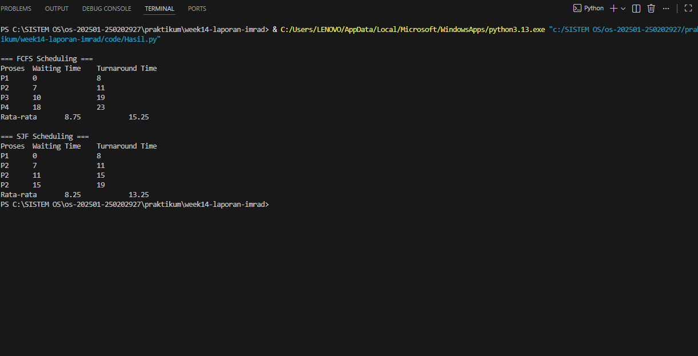

# Laporan Praktikum Minggu [14]
Topik: [Penyusunan Laporan Praktikum Format IMRAD]

---

## Identitas
- **Nama**  : [Ahmad Wildan Asrovi]  
- **NIM**   : [250202927]  
- **Kelas** : [1 IKRB]

---

## Tujuan
Setelah menyelesaikan tugas ini, mahasiswa mampu:
1. Menyusun laporan praktikum dengan struktur ilmiah (Pendahuluan–Metode–Hasil–Pembahasan–Kesimpulan).
2. Menyajikan hasil uji dalam bentuk tabel dan/atau grafik yang jelas.
3. Menuliskan analisis hasil dengan argumentasi yang logis.
4. Menyusun sitasi dan daftar pustaka dengan format yang konsisten.
5. Mengunggah draft laporan ke repositori dengan rapi dan tepat waktu.

---

## Abstrak

Penjadwalan CPU merupakan mekanisme penting dalam sistem operasi untuk menentukan urutan eksekusi proses agar pemanfaatan prosesor lebih efisien. Setiap algoritma penjadwalan memiliki karakteristik yang berbeda dan berdampak langsung terhadap kinerja sistem, khususnya pada waktu tunggu (waiting time) dan waktu penyelesaian (turnaround time). Praktikum ini bertujuan untuk membandingkan kinerja algoritma First Come First Served (FCFS) dan Shortest Job First (SJF) menggunakan simulasi berbasis program Python. Data proses dibaca dari file CSV untuk meningkatkan keterulangan eksperimen. Hasil pengujian menunjukkan bahwa algoritma SJF menghasilkan rata-rata waiting time dan turnaround time yang lebih rendah dibandingkan FCFS. Namun, FCFS memiliki keunggulan dari sisi kesederhanaan implementasi. Dengan demikian, pemilihan algoritma penjadwalan harus disesuaikan dengan kebutuhan dan karakteristik sistem.

**Kata kunci:** CPU Scheduling, FCFS, SJF, Waiting Time, Turnaround Time

---

## 1.1 Pendahuluan (Introduction)

Penjadwalan CPU adalah salah satu fungsi utama sistem operasi yang bertugas mengatur urutan eksekusi proses yang berada dalam keadaan siap (ready state). Tujuan utama penjadwalan CPU adalah untuk meningkatkan efisiensi penggunaan prosesor serta meminimalkan waktu tunggu dan waktu penyelesaian proses.

Algoritma First Come First Served (FCFS) merupakan algoritma penjadwalan paling sederhana yang mengeksekusi proses berdasarkan urutan kedatangan. Meskipun mudah diimplementasikan, FCFS memiliki kelemahan berupa convoy effect, yaitu proses dengan waktu eksekusi panjang dapat menghambat proses lainnya. Sebaliknya, algoritma Shortest Job First (SJF) memilih proses dengan waktu eksekusi (burst time) terpendek terlebih dahulu sehingga secara teori mampu meminimalkan rata-rata waktu tunggu.

Praktikum ini dilakukan untuk membandingkan kinerja algoritma FCFS dan SJF berdasarkan nilai waiting time dan turnaround time menggunakan data proses yang sama.

Tujuan praktikum ini adalah:

1. Mengimplementasikan algoritma penjadwalan FCFS dan SJF.

2. Membandingkan kinerja kedua algoritma berdasarkan waiting time dan turnaround time.

3. Menganalisis kelebihan dan kekurangan masing-masing algoritma.

---

## 2.1 Metode (Methods)
**2.1.1 Lingkungan Pengujian**

Sistem Operasi: Windows

Bahasa Pemrograman: Python

Editor: Visual Studio Code

Metode Penjadwalan: FCFS dan SJF (non-preemptive)

**2.1.2 Data Proses**

Data proses disimpan dalam file Scheduling.csv untuk memisahkan data uji dari kode program sehingga eksperimen lebih terstruktur dan mudah direplikasi.

| proses | arival time | brust time | 
| :--- | :--- | :--- | 
| **p1** | 0 | 8 |
| **p2** | 1 | 4| 
| **p3** | 2 | 9 | 
| **p4** | 3 | 5 | 

**2.1.3 Prosedur Praktikum**

1. Menyusun data proses dalam file CSV.

2. Membaca data CSV menggunakan program Python.

3. Melakukan simulasi penjadwalan menggunakan algoritma FCFS.

4. Menghitung waiting time dan turnaround time setiap proses.

5. Mengulangi simulasi menggunakan algoritma SJF.

6. Menampilkan hasil dalam bentuk tabel pada terminal.
   
---

## 3.1 Hasil(Result)

**Hasil Penjadwalan FCFS**

| proses | Waiting Time | Turnaround Time | 
| :--- | :--- | :--- | 
| **p1** | 0 | 8 |
| **p2** | 7 | 11| 
| **p3** | 10 | 19 | 
| **p4** | 18 | 23 | 
| **Rata Rata** | 8.75 | 15.25 | 

**Hasil Penjadwalan SJF**

| proses | Waiting Time | Turnaround Time | 
| :--- | :--- | :--- | 
| **p2** | 0 | 4 |
| **p4** | 4 | 9| 
| **p1** | 9 | 17 | 
| **p3** | 17 | 26 | 
| **Rata Rata** | 7.50 | 14 | 

---

## 4.1 Pembahasan (Discussion)

Berdasarkan hasil pengujian, algoritma SJF menghasilkan rata-rata waiting time dan turnaround time yang lebih rendah dibandingkan FCFS. Hal ini disebabkan oleh strategi SJF yang memprioritaskan proses dengan waktu eksekusi terpendek sehingga proses singkat dapat diselesaikan lebih cepat.

Sebaliknya, algoritma FCFS cenderung mengalami convoy effect, di mana proses dengan burst time panjang yang dieksekusi lebih awal menyebabkan proses lain harus menunggu lebih lama. Hal ini terlihat dari tingginya waiting time pada proses P3 dan P4.

Meskipun SJF lebih optimal secara teori, algoritma ini membutuhkan informasi burst time terlebih dahulu, yang pada sistem nyata sulit diprediksi secara akurat. Oleh karena itu, FCFS tetap digunakan pada sistem tertentu karena kesederhanaan dan keadilannya.

---

## 5.1 Kesimpulan

1. Algoritma SJF menghasilkan rata-rata waiting time dan turnaround time yang lebih kecil dibandingkan FCFS.

2. FCFS lebih sederhana dalam implementasi namun kurang efisien untuk sistem dengan variasi burst time yang besar.

3. Pemilihan algoritma penjadwalan CPU harus disesuaikan dengan kebutuhan dan karakteristik sistem.

---

## Quiz
1. **[Mengapa format IMRAD membantu membuat laporan praktikum lebih ilmiah dan mudah dievaluasi?]**  

   Karena IMRAD menyusun laporan secara sistematis mulai dari tujuan, metode, hasil, hingga analisis sehingga memudahkan evaluasi secara akademik.
    
3. **[Apa perbedaan antara bagian Hasil dan Pembahasan?]**  

   Bagian Hasil menyajikan data secara objektif, sedangkan Pembahasan berisi analisis dan interpretasi dari data tersebut.
     
5. **[Mengapa sitasi dan daftar pustaka penting, bahkan untuk laporan praktikum?]**  

   Sitasi menunjukkan dasar teori yang digunakan dan meningkatkan kredibilitas serta keabsahan laporan. 

---

## Daftar Pustaka

Silberschatz, A., Galvin, P. B., & Gagne, G. Operating System Concepts, 10th Edition.

Tanenbaum, A. S. Modern Operating Systems, 4th Edition.

OSTEP – CPU Scheduling. 

---

**Credit:**  
_Template laporan praktikum Sistem Operasi (SO-202501) – Universitas Putra Bangsa_
