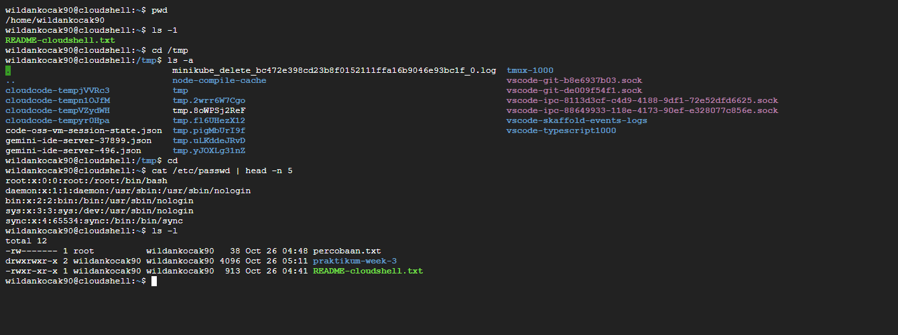

# Laporan Praktikum Minggu [3]
Topik: [Manajemen File dan Permission di Linux]

---

## Identitas
- **Nama**  : [Ahmad Wildan Asrovi]  
- **NIM**   : [250202927]  
- **Kelas** : [1 IKRB]

---

## Tujuan
> Setelah menyelesaikan tugas ini mahasiswa mampu:
> 
1.Menggunakan perintah ls, pwd, cd, cat untuk navigasi file dan direktori.

2.Menggunakan chmod dan chown untuk manajemen hak akses file.

3.Menjelaskan hasil output dari perintah Linux dasar.

4.Menyusun laporan praktikum dengan struktur yang benar.

5.Mengunggah dokumentasi hasil ke Git Repository tepat waktu

---

## Dasar Teori
Dalam sistem operasi Linux, perintah dasar seperti ls, pwd, cd, dan cat digunakan untuk melakukan navigasi file dan direktori, menampilkan isi folder, mengetahui posisi kerja, berpindah antar direktori, serta melihat isi file teks. Selain itu, perintah chmod dan chown digunakan untuk mengatur hak akses dan kepemilikan file guna menjaga keamanan sistem. Setiap perintah Linux menghasilkan output yang memberikan informasi tentang kondisi file atau sistem, sehingga pemahaman terhadap hasil output sangat penting agar pengguna dapat bekerja dengan efektif dan memahami fungsi dari setiap perintah yang dijalankan..

---

## Langkah Praktikum
1. Langkah-langkah yang dilakukan.  
2. Perintah yang dijalankan.  
3. File dan kode yang dibuat.  
4. Commit message yang digunakan.

---

## Kode / Perintah
Tuliskan potongan kode atau perintah utama:
```bash
pwd
ls -l
cd /tmp
ls -a
cat /etc/passwd | head -n 5
echo "Hello <NAME><NIM>" > percobaan.txt
ls -l percobaan.txt
chmod 600 percobaan.txt
ls -l percobaan.txt
```

---

## Hasil Eksekusi



---

## Analisis
- Jelaskan makna hasil percobaan.  
- Hubungkan hasil dengan teori (fungsi kernel, system call, arsitektur OS).  
- Apa perbedaan hasil di lingkungan OS berbeda (Linux vs Windows)?  

---

## Kesimpulan
Tuliskan 2–3 poin kesimpulan dari praktikum ini.

---

## Quiz
1. [Pertanyaan 1]  
   **Perintah chmod berfungsi untuk mengubah hak akses file atau direktori di Linux, menentukan siapa yang bisa membaca, menulis, atau mengeksekusi file.**  
2. [Pertanyaan 2]  
   **Kode permission rwxr-xr-- artinya: pemilik bisa baca, tulis, dan eksekusi; grup bisa baca dan eksekusi; pengguna lain hanya bisa baca.**  
3. [Pertanyaan 3]  
**Perbedaan utama antara chown dan chmod adalah:**
   
  **chown digunakan untuk mengubah pemilik atau grup file/direktori.**

  **chmod digunakan untuk mengubah hak akses (read, write, execute) file/direktori.**

  **Singkatnya, chown mengatur siapa pemiliknya, sedangkan chmod mengatur apa yang bisa dilakukan terhadap file.**


---

## Refleksi Diri
Tuliskan secara singkat:
- Apa bagian yang paling menantang minggu ini?  
- Bagaimana cara Anda mengatasinya?  

---

**Credit:**  
_Template laporan praktikum Sistem Operasi (SO-202501) – Universitas Putra Bangsa_
