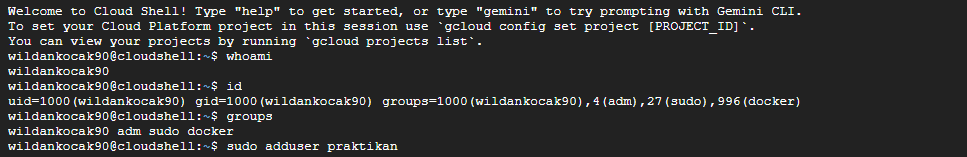
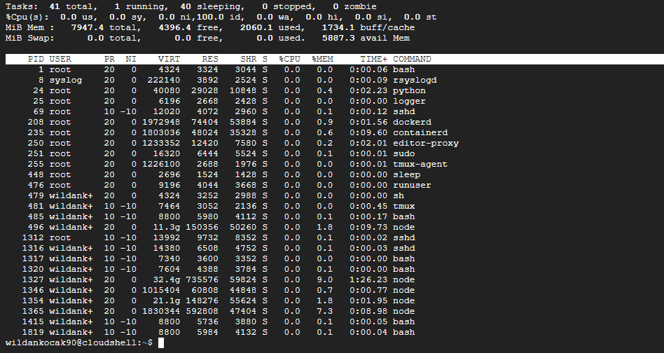
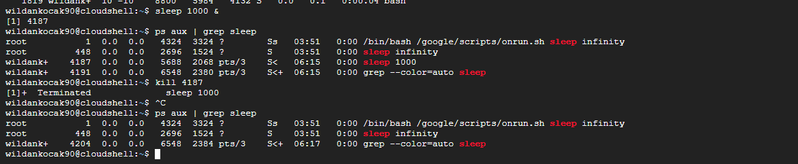

# Laporan Praktikum Minggu [4]
Topik: [Manajemen Proses dan User di Linux]

---

## Identitas
- **Nama**  : [Ahmad Wildan Asrovi]  
- **NIM**   : [250202927]  
- **Kelas** : [1 IKRB]

---

## Tujuan 
> Setelah menyelesaikan tugas ini, mahasiswa mampu:

1.Menjelaskan konsep proses dan user dalam sistem operasi Linux.

2.Menampilkan daftar proses yang sedang berjalan dan statusnya.

3.Menggunakan perintah untuk membuat dan mengelola user.

4.Menghentikan atau mengontrol proses tertentu menggunakan PID.

5.Menjelaskan kaitan antara manajemen user dan keamanan sistem.

---

## Dasar Teori
Dalam sistem operasi Linux, proses adalah program yang sedang dijalankan oleh sistem, sedangkan user adalah akun yang digunakan untuk mengakses sistem. Setiap proses dijalankan oleh user tertentu, dan hak akses proses bergantung pada izin user tersebut. Untuk memantau proses, perintah seperti ps, top, atau htop digunakan untuk menampilkan daftar proses yang berjalan beserta statusnya.
Manajemen user dilakukan dengan perintah seperti useradd, usermod, dan passwd, yang memungkinkan administrator menambah, mengubah, atau mengelola akun pengguna. Untuk mengontrol proses, perintah kill atau killall digunakan untuk menghentikan proses tertentu berdasarkan PID atau nama proses.
Manajemen user sangat berkaitan dengan keamanan sistem, karena hak akses dan izin yang diberikan pada setiap user menentukan siapa yang dapat mengakses, mengubah, atau mengeksekusi file dan proses, sehingga menjaga integritas dan keamanan sistem Linux.


---

## Langkah Praktikum
1. Langkah-langkah yang dilakukan.  
2. Perintah yang dijalankan.  
3. File dan kode yang dibuat.  
4. Commit message yang digunakan.

---

## Kode / Perintah
Tuliskan potongan kode atau perintah utama:
```bash
whoami
id
groups
sudo adduser praktikan
sudo passwd praktikan
ps aux | head -10
top -n 1
sleep 1000 &
ps aux | grep sleep
kill <PID>
pstree -p | head -20
```

---

## Hasil Eksekusi
Sertakan screenshot hasil percobaan atau diagram:



.png)

---

## Analisis
- Jelaskan makna hasil percobaan.  
- Hubungkan hasil dengan teori (fungsi kernel, system call, arsitektur OS).  
- Apa perbedaan hasil di lingkungan OS berbeda (Linux vs Windows)?  

---

## Kesimpulan
Tuliskan 2–3 poin kesimpulan dari praktikum ini.

---

## Quiz
1. [Pertanyaan 1]  
   **init atau systemd berfungsi sebagai proses pertama saat Linux booting yang mengatur dan menjalankan semua layanan serta proses sistem, memastikan sistem siap digunakan.**  
2. [Pertanyaan 2]  
   **kill menghentikan proses berdasarkan PID, sedangkan killall menghentikan semua proses berdasarkan nama proses.**  
3. [Pertanyaan 3]  
   **User root memiliki hak istimewa karena bertindak sebagai administrator sistem, sehingga dapat mengakses, mengubah, dan mengelola semua file, direktori, dan pengaturan sistem tanpa batasan.**  

---

## Refleksi Diri
Tuliskan secara singkat:
- Apa bagian yang paling menantang minggu ini?  
- Bagaimana cara Anda mengatasinya?  

---

**Credit:**  
_Template laporan praktikum Sistem Operasi (SO-202501) – Universitas Putra Bangsa_
