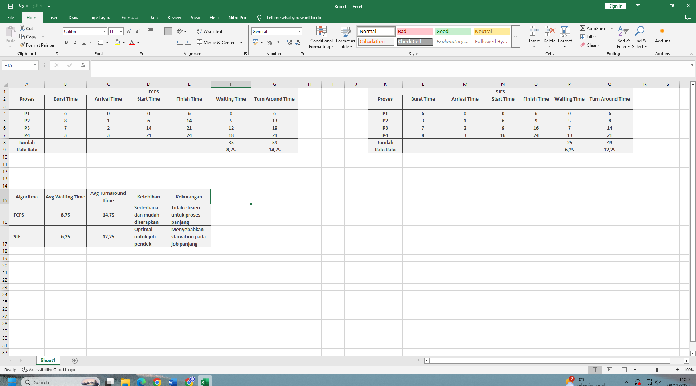

# Laporan Praktikum Minggu [5]
Topik: [Penjadwalan CPU – FCFS dan SJF]

---

## Identitas
- **Nama**  : [Ahmad Wildan Asrovi]  
- **NIM**   : [250202927]  
- **Kelas** : [1IKRB]

---

## Tujuan
> Mahasiswa mampu menjelaskan fungsi utama sistem operasi dan peran kernel serta system call.

1.Menghitung waiting time dan turnaround time untuk algoritma FCFS dan SJF.

2.Menyajikan hasil perhitungan dalam tabel yang rapi dan mudah dibaca.

3.Membandingkan performa FCFS dan SJF berdasarkan hasil analisis.

4.Menjelaskan kelebihan dan kekurangan masing-masing algoritma.

5.Menyimpulkan kapan algoritma FCFS atau SJF lebih sesuai digunakan.

---

## Dasar Teori
FCFS (First Come First Served) menjadwalkan proses berdasarkan urutan kedatangannya dalam antrean FIFO, sedangkan SJF (Shortest Job First) memprioritaskan proses dengan waktu eksekusi (burst time) terpendek untuk dilayani terlebih dahulu. Keduanya adalah algoritma penjadwalan CPU yang bertujuan mengelola proses, tetapi memiliki kelebihan dan kekurangan yang berbeda, di mana FCFS sangat sederhana namun bisa menghasilkan waktu tunggu lama, sedangkan SJF dapat meminimalkan waktu tunggu rata-rata tetapi lebih kompleks.

---

## Langkah Praktikum
1. Langkah-langkah yang dilakukan.  
2. Perintah yang dijalankan.  
3. File dan kode yang dibuat.  
4. Commit message yang digunakan.

---

## Kode / Perintah
Tuliskan potongan kode atau perintah utama:
```bash
Waiting Time (WT) = waktu mulai eksekusi - Arrival Time
Turnaround Time (TAT) = WT + Burst Time
```

---

## Hasil Eksekusi
Sertakan screenshot hasil percobaan atau diagram:


---

## Analisis
Perbandingan Rata-Rata WT dan TAT antara FCFS dan SJF
Berdasarkan hasil perhitungan, algoritma FCFS (First Come First Served) memiliki rata-rata Waiting Time (WT) sebesar 8,75 dan Turnaround Time (TAT) sebesar 14,75, sedangkan algoritma SJF (Shortest Job First) memiliki rata-rata Waiting Time sebesar 6,25 dan Turnaround Time sebesar 12,25. Hasil tersebut menunjukkan bahwa algoritma SJF lebih efisien dibandingkan FCFS karena mampu mengurangi waktu tunggu dan waktu penyelesaian rata-rata. Hal ini terjadi karena SJF mengeksekusi proses dengan waktu eksekusi paling singkat terlebih dahulu, sehingga mengoptimalkan penggunaan CPU dan mempercepat penyelesaian proses.

---

## Kesimpulan
Kesimpulan:
Algoritma SJF lebih unggul dibandingkan FCFS dalam hal efisiensi waktu, terutama ketika proses memiliki durasi eksekusi yang bervariasi. Namun, FCFS tetap lebih adil karena menjalankan proses berdasarkan urutan kedatangan tanpa memperhatikan lamanya waktu eksekusi.

---

## Quiz
  **Jawaban:**  
1. Perbedaan FCFS dan SJF
Algoritma FCFS (First Come First Served) menjalankan proses berdasarkan urutan kedatangan. Sistem ini adil, tetapi kurang efisien karena proses kecil bisa menunggu proses besar selesai (convoy effect).
Sementara itu, SJF (Shortest Job First) menjalankan proses dengan waktu eksekusi paling singkat terlebih dahulu. Algoritma ini lebih efisien karena waktu tunggu rata-rata lebih kecil, namun bisa menyebabkan proses       panjang tertunda (starvation).
Secara singkat, FCFS menekankan keadilan, sedangkan SJF menekankan efisiensi.

 **Jawaban:** 
 
2. Algoritma SJF (Shortest Job First) menghasilkan rata-rata waktu tunggu minimum karena proses dengan waktu eksekusi paling singkat dijalankan terlebih dahulu. Dengan cara ini, proses-proses cepat tidak perlu menunggu proses yang lebih lama selesai, sehingga total waktu tunggu semua proses menjadi lebih kecil. Urutan eksekusi yang mengutamakan proses singkat membuat penggunaan CPU lebih efisien dan meminimalkan waktu tunda secara keseluruhan

 **Jawaban:** 
 
3. Kelemahan algoritma SJF (Shortest Job First) pada sistem interaktif adalah sulitnya memperkirakan waktu eksekusi setiap proses secara akurat. Selain itu, algoritma ini dapat menyebabkan proses dengan waktu eksekusi panjang tertunda terus-menerus karena selalu didahului oleh proses yang lebih singkat. Akibatnya, sistem menjadi kurang responsif dan dapat menimbulkan masalah starvation pada proses-proses besar.    
  

---

## Refleksi Diri
Tuliskan secara singkat:
- Apa bagian yang paling menantang minggu ini?  
- Bagaimana cara Anda mengatasinya?  

---

**Credit:**  
_Template laporan praktikum Sistem Operasi (SO-202501) – Universitas Putra Bangsa_
